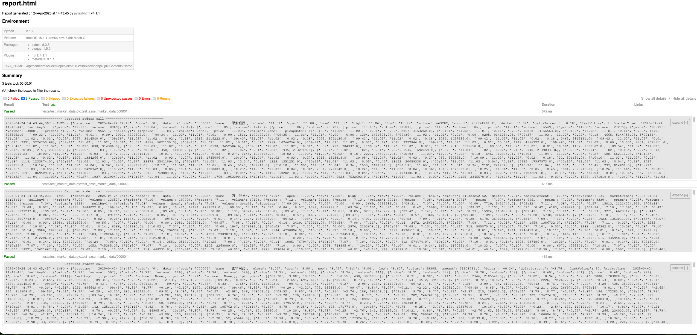

# SZSE Market Data Verification

This project automates the verification of market data for a given stock code from the **Shenzhen Stock Exchange (SZSE)** using their public API.

It checks:
- That the API returns an HTTP 200 status
- That the "High" value is greater than the "Low" value

The test result is logged to console and reported in HTML format.

---

## 📁 Project Structure

    QA_Challenges_Question_3/ 
    ├── core/ 
    │ ├── init.py 
    │ └── logger_config.py# Logger setup 
    ├── tests/ 
    │ └── test_market_data.py # Test script 
    ├── README.md 
    ├── pyproject.toml # Poetry project config 
    ├── poetry.lock 
    └── report.html # Generated HTML test report

---

## ⚙️ Setup Instructions

### 1. Clone the repository

```bash
git clone <your-repo-url>
cd QA_Challenges_Question_3
```
### 2. Install Poetry (if not already installed)

```bash
pip install poetry
```
### 3. Install dependencies

```bash
poetry install
```
If the project fails to install due to a missing README.md, use:
```bash
poetry install --no-root
```
---
▶️ Run the Test
```bash
cd tests
poetry run pytest test_market_data.py --html=report.html
```
This will run the test case and generate report.html inside the tests/ directory.
for example:

---
📝 Notes
---
Python version: >=3.13 (as defined in pyproject.toml)

All logs are managed using a custom logger in core/logger_config.py

The API endpoint used is from the SZSE official website and may change

---
🔧 Customize
---
To test multiple stock codes, modify the @pytest.mark.parametrize section in test_market_data.py.

`@pytest.mark.parametrize("stock_code", ["000001", "000002", "000003"])
`
---
👨‍💻 Author:
Simon Poon
Email: kalunpoon926@gmail.com